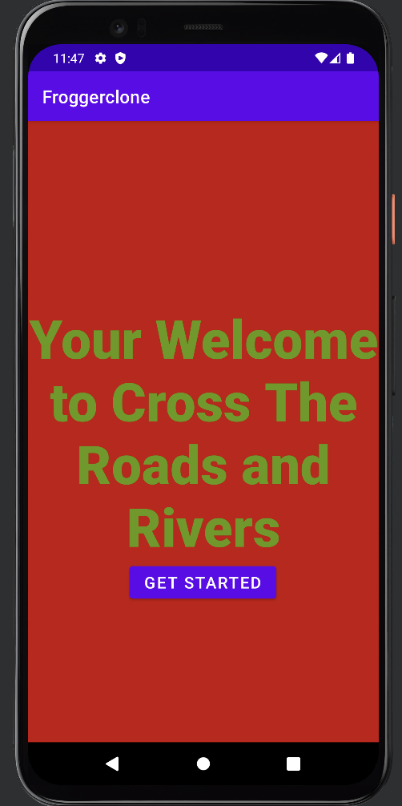
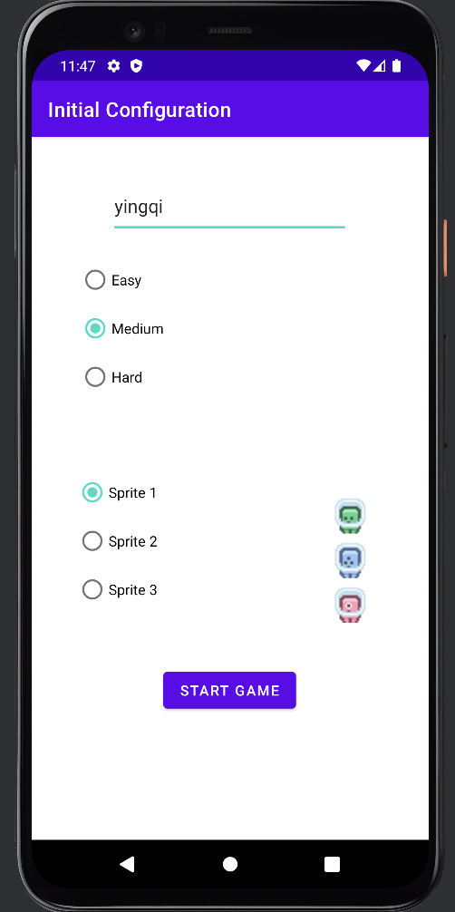
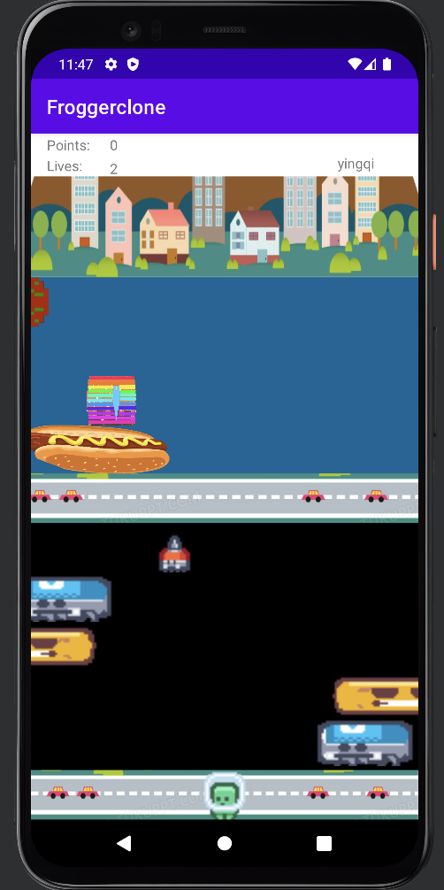
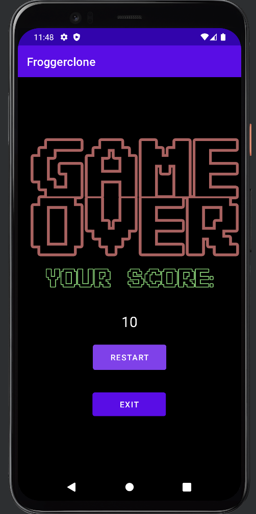

# frogger-clone
## This game was produced with the team of 5 in class CS2340 to develope the frogger game design via Android Studio.

** Major working environment: Java **

Welcome to the git repo for team 64's Android frogger clone game!

### The screenshot for the game:

1. this is the game start panel, and the user is able to start the game.

2. this is the game dashboard panel, user is able to type the user name, characters(sprites), and the weighted for the game from easy to difficult.

3. this is the main panel for game implementing, user is able to move, and rest at the logs. if user hit the obstacles, user will lose the life.

4. this is when the user used all of the life, and lose the game.

